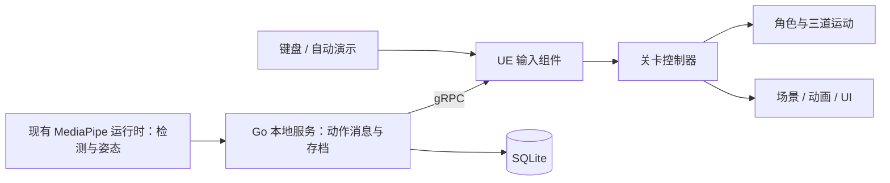

# 《向星而行》UE 实现架构与设计 · 简化版

> 根据用户最新要求，替换上一版的复杂字段与模块设计。
> 画面参考《向星而行_自动演示.html》，任务和动作规则仍依据原设定；HTML 的自动计时不作为正式玩法规则。
> 当前已有 MediaPipe ObjectDetector + efficientdet_lite0.tflite：用户报告多人合成图 2/2 检出、空屏 0 误报、单次耗时 66–119 ms。本文未复测这些结果。
> 本文是实施设计；仓库目前没有 UE 工程或识别源码，文中参数均需在目标设备调试。

## 1. 首版只保留这些东西

**一个 UE 游戏模块，一个 gRPC 插件，一个 Go 本地服务，一份 SQLite。画面采用固定相机、近景低模 3D、远景平面分层。**



| UE 对象 | 保留的责任 |
|---|---|
| `UStarServiceSubsystem` | gRPC 连接、输入队列、存档请求；跨关卡存在 |
| `ABP_LevelDirector` | 固定路段、三个任务点、暂停和结算；一个关卡一个 |
| `ABP_Runner` | `APawn`，自动前进、三道切换、当前动作；配一个运动组件和 AnimBP |
| `ABP_Station` | 一个通用任务 Actor，配置动作步骤；邮站、灯、花台只换外观和演出 |
| `WBP_GameHUD` | 星光、0/3 任务、动作图标、文字、暂停；其他页面用普通 Widget |

输入接收放进一个 `UActionInputComponent`，不再为 Profile、LevelFlow、Highlight、Assist 各建立独立 Subsystem。狐狸和云鲸使用简单蓝图 Actor，先不用行为树。

C++ 做 gRPC、线程队列、运动与动作接收；蓝图做固定关卡组织、Timeline、材质、灯光、特效和 UI。任务点完成状态和结算入口保持唯一，避免多处修改。

一个 `DA_Level` 就足够：地图、主题、路段顺序、三个任务点。任务点只配置 `Steps: Action[]`，例如左腿、右腿两个步骤；路段和障碍直接在编辑器摆放。暂不建立完整的校验器、资产注册框架或自定义编辑器模块。

## 2. 字段与校验减到什么程度

### 2.1 动作消息只保留三个语义字段

```text
ActionEvent
  generation   本轮有效输入编号
  action       蹲下 / 左腿 / 右腿 / 左跳 / 右跳 / 开合跳
  phase        Begin / Complete / Cancel
```

人体状态单独发送：`Lost / NotReady / Ready`，同样携带 `generation`。站立表达为准备状态，不当成一个可重复计数的动作；游戏仍保留七种动作语义。

- `Begin`：抬腿、跳跃立即给出游戏反馈；蹲下开始持续俯身。
- `Complete`：放下腿、开合跳收回、左右跳回位站稳、蹲下后站起；机关此时才推进。
- `Cancel`：周期作废，例如追踪丢失；不能把取消蹲下当成实际站立。
- `Ready`：当前真人回到中央并稳定站立，可以准备下一动作。恢复暂停仍需玩家确认。

假定识别端只允许一个动作在进行、同一 gRPC 流有序发送、断线不重放历史动作，因此首版删除 `GestureId、Sequence、ContextId、Confidence、ServiceInstanceId` 等业务字段。置信度留在识别器内部，关卡与任务编号留在 UE，不随每次动作发送。

`generation` 保留一个就够，负责让暂停前、旧任务、旧连接中的动作失效。开始输入、进入或离开任务、暂停恢复、点击完成、重连、切换输入源时递增；正常机关步骤完成时不需要反复重建输入。

### 2.2 UE 只做四项输入判断

1. 当前输入编号是否一致。
2. 游戏当前是否允许开始这个动作。
3. 新 `Begin` 是否处于 Ready 且没有其他进行中的动作。
4. `Complete / Cancel` 是否匹配当前动作。

`Complete / Cancel` 不再检查 Ready，否则动作开始后 Ready=false 会把完成事件也拦住。每次完成只消费一次，然后清空当前动作；后面的 Ready 更新准备状态。任务的允许动作不影响识别器分类，不能把“不允许的开合跳”误判为允许的抬腿。

动作与状态共用一个有序发送队列：`Ready → Begin → Complete / Cancel → Ready`。UE 接受 Begin 后自己退出 Ready；识别端不能先因为开始抬腿而发送 NotReady，再发送 Begin，否则正常动作会被拒绝。NotReady 用于尚未准备好或需要重新就绪的阶段。

UE 输入组件本地只需 `Generation、TrackingState、ActiveAction`。运行阶段、当前道、任务步骤属于关卡和角色，不塞进协议。

### 2.3 generation 的最小实现约定

UE 先递增编号、清空本地旧动作并置为 NotReady，再通知识别端重置。识别端从相机帧进入处理链时绑定编号，丢弃旧待处理帧；正在推理的旧帧仍保留旧编号，不能在推理结束时贴上新的编号，也不能让其回调修改新一轮动作状态机。新编号下重新确认真人站稳后发送 Ready。

断线时丢弃旧流与排队输入，建立新流。相机画面、Lost / NotReady 状态在暂停期间继续更新；只是身体动作不再驱动玩法。网络线程只向队列写普通数据，游戏线程更新 Actor 和 UI。

首版不做复杂消息重试；动作错过后让玩家重新做。队列若溢出，暂停并重新就绪，不能静默丢掉 Complete。

### 2.4 存档只需要两张核心表

```text
progress(level_id PRIMARY KEY, completed, best_score)
runs(run_id PRIMARY KEY, level_id, score, active_ms, action_counts_json)
```

三关星种由各关 `completed` 得到，下一关解锁由前一关完成得到。动作次数用一个 JSON 字段，不拆成一组子表。正式加入纪念页后，再增一张 `media(id, run_id, kind, path, source_ids_json, has_portrait)`；别提前建立完整媒体任务数据库。

UE 结算生成一次 `run_id`，保存失败时以同一 ID 重试；Go 一个事务写本局记录和关卡进度。相同 run_id 已保存时返回原结果，不重复领奖。保留唯一键和事务即可，首版不增加结果摘要与通用命令去重表。

未保存结果追加到一个本地 JSON 待提交列表，逐条确认保存后移除，不覆盖前一局未保存结果；设置也可用小型 JSON。只支持通关保存，不承诺中途断点续玩。

## 3. 现有 MediaPipe 怎么接

### 3.1 EfficientDet 能做什么

`ObjectDetector + efficientdet_lite0.tflite` 检测 COCO 的 person 类，输出人框和分数，可用于有人 / 无人、人数和粗略站位提示。

**它没有身体关节，不能直接判断抬左腿、抬右腿、完整开合跳或左右跳回位。人框宽高变化也不足以可靠替代这些动作。** 检测到整个人框不等于已确认双脚全都可见。

现有“2/2、空屏 0 误报”可以作为这些测试图片通过的结果，不能推导连续视频、遮挡、动作分类或稳定多人身份跟踪已经通过。

如果 66–119 ms 指单次推理耗时，串行吞吐约为每秒 8–15 次；这不是相机到 UE 的完整动作延迟，也不是游戏帧率。采集、姿态推理、动作确认窗口和消息传递还会增加延迟。

### 3.2 补 Pose Landmarker，保留当前已跑通的运行时

```text
相机唯一采集入口
  ├─ ObjectDetector：准备页选人、低频检查人框 / 人数
  └─ Pose Landmarker：视频姿态关键点
         ↓
      小型动作状态机
         ↓
      action + phase + generation
         ↓
      Go → gRPC → UE
```

Pose Landmarker 提供肩、髋、膝、踝等关键点；七种动作的分类和完整周期仍需自己实现。正常游戏时使用姿态任务的视频检测 / 跟踪机制，不必让每一帧先串行跑一次 EfficientDet 再跑姿态。保留最新待处理帧，避免逐渐积压造成“人已经落地，游戏才开始跳”。

相机只由当前识别运行时打开一次，Go 和 UE 不再争抢同一设备。MediaPipe 若已在 Python、C++ 或其他环境跑通，就保留现有实现，通过本机适配接入 Go；不强制迁移到 Go，也不假定有可直接使用的官方 Go Tasks API。上图是逻辑链路，具体是否增加进程取决于当前部署。

首版只接受活动区域内一名玩家。多人进入该区域时提示暂停，比实现多人身份追踪简单。只配置 `num_poses=1` 不等于人物身份已锁定；遮挡或出现旁人后应重新确认中央玩家，不能直接把“第一个输出”当成原玩家。

### 3.3 动作识别只做一个互斥状态机

```text
未就绪 → 中央站稳 → 判断候选动作 → 锁定一种动作 → 完成 / 取消 → 中央站稳
```

| 动作 | 最少需要的时序信息 |
|---|---|
| 蹲下 / 站立 | 髋部高度和膝部屈伸，相对标定身高归一化；持续保持到真实站起 |
| 抬左 / 右腿 | 对应髋膝踝关系及离地趋势；放下后才完成 |
| 左右跳 | 人体横向位移加跳跃时序证据；普通侧移不能算跳 |
| 开合跳 | 双脚分开与双臂举起的联合条件，再收回 |
| 左右跳后回位 | 回到标定中央并站稳；期间不产生新的动作 |

先在短候选窗口里区分动作，再发 Begin；不要先发“抬腿”，随后才发现其实是开合跳。同一周期只触发一种效果。单目姿态仍需验证跳跃与侧移的区分，不能仅凭一个脚踝高度阈值宣称可用。

镜像只影响预览显示，动作左右按玩家身体定义。真人回位不改变游戏跑道；处于最外道继续向外跳时，仍要完成现实回位。

初期验证聚焦四件事：左右不反、开合跳不夹带抬腿、回位不反向换道、入镜恢复前必须确认。无需先做庞大的姿态评分系统。

## 4. HTML 的美感来自哪里

参考文件不是 WebGL 3D，而是 Canvas 2D：用投影公式把三道道路和物体画出纵深，再叠加渐变、剪影、光晕与轻微摆动。

UE 应复现它的构图和视觉语言：**固定透视、冷色大环境、暖色小焦点、低细节轮廓、缓慢持续运动。** 首版使用 2.5D 思路的实际 3D 场景，不必把 HTML 嵌入浏览器充当游戏画面。

| 从 HTML 提取的构图 | UE 摆放目标 |
|---|---|
| 消失点约在画面 `(50%, 45%)` | 固定后视透视相机，跑道通向画面中央 |
| 角色脚底约在画面高度 86% | 人物放下方，给远景和机关留空间 |
| 角色高度约为画面高度 13% | 保留小小旅人和大世界的比例 |
| 巨行星中心约 `(62%, -20%)`，半径约 62% 画面高 | 行星上半部在画面外，下缘接近地平线 |
| 三层群山在约 46%、50%、54% 高度 | 三张不同深浅的剪影卡片，远淡近深 |
| 狐狸在玩家右侧，小伙伴在左侧 | 保持清楚的三者轮廓，避免遮挡脚印和路面 |

这些是参考画面比例，不是硬编码世界坐标。先在 16:10 对齐 HTML，再检查实际 16:9 屏幕。相机 FOV 可从 45–55° 起调，道宽从 160–200 cm 起调，最终按角色尺度和目标构图调整。

相机随纵向前进，横向主要跟道路中心，角色换道时镜头不跟着急摆；装饰性转头、镜头漂移不能影响动作提示可读性。

## 5. 用哪些 UE 资产还原画面

| HTML 元素 | UE 实现 | 首版资产量 |
|---|---|---|
| 渐变天空 | Unlit 背景材质，三段颜色渐变 | 一个材质，三套主题参数 |
| 巨大行星 | 朝向相机的圆形遮罩平面，渐变与边缘光晕 | 一个 Plane + 一个材质 |
| 山 / 远处飞船 | Masked 剪影平面，适量视差 | 3 层山 + 少量主题卡片 |
| 三道道路 | 真实三维路面，透视来自相机 | 一组直路和安全空地模块 |
| 路面分隔与横纹 | 一张道路材质，边线亮、分道线淡 | 一个主材质 |
| 星点与漂浮星光 | 天空材质闪烁 + 小规模 Niagara | 两套效果 |
| 树、石块、风车 | 低多边形模型，实色材质 | 每类 1–2 个变体即可 |
| 云桥与云团 | 圆润低模；远处云可用平面 | 少量静态网格 |
| 宇航员、狐狸 | 有骨骼的简洁卡通模型 | 两个主要角色资产 |
| 云鲸 | 低模 + 尾巴 / 鳍少量骨骼 | 一个模型 |
| 邮站 / 路灯 / 花台 | 同一个任务蓝图的三种外观 | 三套 Mesh 和演出配置 |
| 半透明面板 | UMG 深蓝半透明底、细描边、金色强调 | 一套 UI 样式 |

背景卡片移动到相机远处，并随相机平移保持“无限远”的感觉；近景树、任务站和障碍放在真实世界。道路 UV 默认随真实移动自然产生运动，不要再按 HTML 速度额外滚动出“双倍跑速”。若做特殊流光，其速度单独控制，停靠时暂停跑动条纹。

不把所有东西做成透明卡片：角色、障碍和道路需要稳定遮挡关系。远景优先 Masked / Opaque，发光粒子少量透明即可。

### 5.1 色板直接复用

| 主题 | 天空顶色 | 天空中段 | 地平线 | 道路 | 暖色强调 |
|---|---|---|---|---|---|
| 风邮原野 | `#071A36` | `#35687C` | `#EDBE85` | `#626875` | `#F4C57A` |
| 回声森林 | `#060B27` | `#1A335B` | `#416073` | `#293D55` | `#FFD18C` |
| 云鲸星海 | `#101D48` | `#5377A2` | `#BCBDCA` | `#889DAA` | `#FFE1AD` |

以上是 HTML 的 sRGB 色值；在 UE 中按 sRGB 颜色输入 / 转换，不要直接当成线性浮点颜色。第一关若仍保留原设定的明亮原野方向，可提高道路、草地及地平线亮度，同时保留这套冷暖对比。

### 5.2 材质和灯光要克制

- 近景默认 Metallic=0、Roughness 从 0.75–0.95 起调，减少镜面高光，轮廓圆润、细节简洁。
- 背景 Unlit；一盏柔和主光 + SkyLight 保持角色和障碍可见，接触阴影帮助落地。
- 固定曝光，防止点灯后整幅画面被自动压暗；轻量 Bloom，灯芯有亮度但仍能看见暖黄色。
- 第一版可关闭 Lumen、体积云、景深和运动模糊。使用普通雾或远景色层营造距离，不必模拟浓重体积雾。
- `Emissive + 柔和光晕` 复现 Canvas 的发光感；需要照亮地面时再加有限半径 PointLight。关闭 Lumen 时不能指望自发光材质自然照亮周围。
- 任务灯默认不投射昂贵动态阴影；是否增加由实际画面决定。

角色、狐狸和云鲸的设计质量比额外渲染功能更影响最终效果。灰盒比例稳定后再制作统一模型、材质与骨骼动画，无法仅靠设置几个特效参数获得成品美术。

## 6. 精美动画：持续轻动，交互有层次

以下时长是视觉起调值，不是要求玩家在对应毫秒内完成身体动作。

| 对象 / 动作 | 设计 | UE 做法 |
|---|---|---|
| 跑步 | 轻快小步，身体起伏小，围巾有滞后 | In-place 跑步循环；AnimBP 按实际前进速度切换 |
| 左右换道 | 先离地，再横移，落地轻缓冲；不用激烈震屏 | 0.3–0.45 秒移动曲线，Mesh 叠加跳弧；现实回位锁独立 |
| 蹲下 | 约 0.15 秒混入，俯身轮廓清楚，恢复柔和 | 蹲跑循环；真实站立后混出，不能动画播完自动站起 |
| 左右跨步 | 对应脚清楚抬起、跨过，再落下；上身轻配合 | 两段短动画；与本障碍的动作有效窗口对应 |
| 开合跳 | 打开有星光响应；任务前保持可等待姿态，再收回 | Start / Hold / End 三段或同等状态；收到 Complete 再收尾 |
| 狐狸 | 耳朵轻动、尾巴错相摆动、停下抬头看任务 | 跑步 / 待机循环 + 少量附加动画；插值跟随固定偏移 |
| 云鲸 | 6–8 秒缓慢浮动、尾部轻摆、双鳍错相 | 骨骼或蓝图曲线；背景飞行 Spline |
| 风车与信件 | 机关完成后叶片渐快，信件向远处弧线飞出 | Timeline 转速 + 简短 Spline 路径 |
| 花朵 | 花茎先伸展、花瓣分批打开、花心最后发光 | 一条 Timeline 驱动缩放 / 旋转 / 材质 |
| 星光收集 | 短促聚拢后消失，UI 轻回弹 | 小型 Niagara + UMG 动画 |

跨裂缝的游戏跳跃轨迹按路面时机播放，完成真人开合跳决定下一次动作何时可用，不要求玩家和游戏跳跃逐帧同步。横移使用带 DeltaTime 的插值或定时曲线，不能直接照抄 HTML 每帧固定 0.1 的插值。

蹲下的持续姿态、现实回位锁和机关完成由玩法状态控制；Anim Notify 只做脚步声、粒子和视觉时点。

### 6.1 把点灯做成一套 1.4 秒的标志演出

打开开合跳时可先显示弱星光蓄力；**完整收回后确认任务完成，再启动以下演出**：

| 时间 | 画面与声音 |
|---|---|
| 0.00 秒 | 灯芯出现小金点，一声轻脆确认音 |
| 0.00–0.25 秒 | 灯芯变亮，柔和光晕扩散 |
| 0.15–0.65 秒 | 灯下暖光展开，8–16 颗星点向上飘 |
| 0.35–0.90 秒 | 蘑菇和少量树上光点依次点亮，狐狸看向灯 |
| 0.75–1.40 秒 | 一束光飞向任务 UI，0/3 变 1/3，UI 轻回弹 |

飞向任务 UI 的光只表达任务进度，不额外增加“沿路星光”分数。普通灯用一条 Timeline 驱动材质、灯强和特效；第三盏再加一段短 Sequencer，让黑影伙伴显露并加入队伍。镜头微推可选，幅度约 2%，不旋转、不晃动。

每点一盏灯，主题参数平滑进入下一档：暖光更多、远景雾更淡、小生物更清楚。三盏灯最终状态由完成数量设置，即使跳过演出也一致。

### 6.2 UI 保留 HTML 的气质，不照搬演示工具

深蓝半透明底、细边框、暖金强调、小圆角和充足留白。标题轻、正文清晰，少用粗描边。游戏内只保留星光、任务进度、动作图标 + 文字、暂停和必要回位提示。

网页侧边章节选择、倍速和整段播放进度属于演示模式。正式游戏避免这些面板占走景观空间。第一版只使用不透明度、位移、轻缩放三类 UMG 动画，统一持续时间和缓动。

## 7. HTML 的时间轴怎么迁移

HTML 总长 118 秒：三关各 36 秒，加 10 秒结尾。`completed` 按固定秒数增加，星光是 `floor(t × 1.7)`，障碍根据当前模拟动作绘制；没有碰撞或真实通关判断。

可以保留一个 `AutoDemo` 输入源，按时间表模拟 Begin / Complete，使用与键盘相同的动作入口，驱动同一套 UE 表现。演示模式使用临时进度，不写入真实通关存档。

正式游戏仍然是：任务点强制停靠 → 等完整动作或点击完成 → 播演出 → 继续前进。第二关的具体教学和路段顺序以规则文档为准，不照搬 HTML 为压缩片长调整的次序。

只保留这些直接规则，不建通用校验框架：

- 任务点按路径距离夹紧停车，掉帧也不能跳过。
- 三道始终有可达通路，动作间留回位时间；脚侧与跑道是不同概念。
- 左右跳最多换一条道，回位不换道；抬腿只跨步。
- 点击完成与动作完成进入同一个“完成当前步骤”函数，只推进一次。
- 三个任务完成且到达终点，才结算星种。
- 撞障碍只减速；裂缝由星光伞接回，落点不能越过未完成任务。
- 多次失误后降低后续速度、关闭少量普通障碍，固定任务保留。
- 相机看不到人就暂停，回来站稳并确认后继续。

## 8. 先做一个能证明画面质量的短场景

先完成回声森林的 **20–30 秒键盘 / 自动演示样片**：

1. 一条道路、一个宇航员、一只狐狸，调好固定镜头、巨大行星和三层背景。
2. 完成一棵树、一块石头、一盏灯，锁定模型轮廓和冷暖配色。
3. 加跑步、一次换道、一次蹲下、一套开合跳点灯演出。
4. 点灯后森林变亮，小伙伴出现；录制前后效果对比。
5. 用同一动作入口接入姿态识别，再扩到三个任务点、存档与三关主题。

效果验收以目标机运行画面为准：动作提示清楚、角色轮廓可辨、发光不泛白、背景有层次、输入等待时动画不穿帮。先建立稳定的视觉样板，再复制内容；漫画和 GIF 放在主体验之后。
