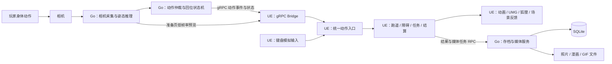

# 《向星而行》UE 实现架构与设计

> 依据：《向星而行_游戏设定与规则 (11).md》。用户提供的两个文件内容一致。
> 技术栈：Go + gRPC + Unreal Engine + SQLite。
> 本文中的游戏规则来自设定文档；进程划分、类名、协议和参数均为实现建议，不代表已有代码。

## 1. 架构结论与实施边界

建议采用 **UE 单机客户端 + Go 本地伴随服务**：UE 是玩法状态的唯一决策方，Go 负责相机、动作识别、存档和媒体编码，SQLite 由 Go 独占写入。

默认首发 Windows PC、单人、单相机、离线可玩。UE 使用项目锁定的 UE5 稳定小版本，具体版本由团队的插件和构建验证决定。若 Go 实际部署在远端，应把相机与动作识别保留在本机，另拆远程存档服务；不建议把实时体感控制依赖于公网。

本项目不需要 UE Dedicated Server、联机复制、GAS 或无限地图生成。三颗星球共用一套玩法，使用固定关卡编排及主题素材替换。

必须明确：**Go、gRPC、UE、SQLite 本身不提供人体姿态识别。** 相机采集和推理还需要选定实现，例如 Go 调用原生相机接口和 ONNX Runtime 绑定。姿态模型、人体关键点质量、平台二进制依赖需要单独验证；它们属于 Go 服务内的识别适配层，不改变 UE 输入接口。

## 2. 进程、职责与数据流



| 能力 | 唯一负责方 | UE 如何使用 |
|---|---|---|
| 相机设备、原始帧、姿态推理 | Go | 接收预览、识别质量和语义动作，不重复打开相机 |
| 左右定义、动作候选仲裁、回位锁 | Go | 使用玩家人体坐标下的动作；显示回位提示 |
| 关卡状态、动作是否生效、碰撞结果、分数 | UE | 本地即时决策，不等待数据库或 RPC 往返 |
| 任务步骤、三个任务点完成条件、星种获得条件 | UE | 判断完成后提交结果，由 Go 持久化 |
| SQLite、存档迁移、结果幂等 | Go | 经 RPC 读写，UE 不直接打开数据库 |
| 人像候选帧 | Go | 仅开启人像高光后保留，用事件 ID 关联 |
| 游戏截图、漫画排版、海报动画画面 | UE | 生成图像或固定步进的动画帧 |
| GIF 编码、媒体索引、文件清理 | Go | 后台任务与进度回传 |

所有规则以 UE 的当前游戏上下文为准。识别到动作不等于动作已被游戏接受：菜单、暂停、机关步骤不匹配时，不能直接改变玩法。

## 3. UE 工程与模块组织

第一版建议两个运行时模块，加一个可选编辑器模块。逻辑上分层即可，不必为每个系统建独立插件。

```text
Source/
  Starward/                         # 游戏模块
    Core/                           # 游戏状态、数据结构、事件
    Input/                          # 统一动作入口、键盘模拟
    Runner/                         # 三道运动、角色动作
    Level/                          # 固定关卡、路段与触发逻辑
    Obstacle/                       # 障碍判定
    Mission/                        # 任务步骤与任务点
    Presentation/                   # 动画、狐狸、音效、场景变化
    UI/                             # UMG 页面与 ViewModel
    Media/                          # 截图、漫画及海报渲染
  StarwardEditor/                   # 可选：关卡规则校验工具
Plugins/
  StarwardBridge/
    Source/StarwardBridge/          # UE 类型与 gRPC 适配
    Source/ThirdParty/Grpc/         # gRPC / protobuf 库及构建配置
Content/Starward/
  Maps/                             # 三颗星球与菜单
  Data/                             # Level / Segment / Action / Theme
  Blueprints/                       # 场景、障碍、任务点表现
  Characters/                       # 角色、狐狸、小生物、动画
  UI/
  VFX/
Protocols/                          # .proto，Go 与 C++ 共用来源
```

gRPC 生成代码和第三方类型只放在 Bridge 的私有实现中。游戏模块只接触 `FBodyActionEvent`、`FTrackingStatus`、`FRunResult` 等 UE 数据结构，避免 protobuf 依赖扩散到蓝图和玩法代码。

### 3.1 核心类与生命周期

| 类 / 系统 | 生命周期 | 核心职责 |
|---|---|---|
| `UStarwardGameInstance` | 应用 | 入口、跨关卡导航；不堆积所有玩法 |
| `ULocalServiceSubsystem` | GameInstance | 启停自有 Go 进程、连接、协议握手、重连 |
| `UProfileSubsystem` | GameInstance | 进度读取、结算提交、待提交结果管理 |
| `UBodyInputSubsystem` | LocalPlayer | Camera / Keyboard 输入切换、事件校验和语义分发 |
| `AStarwardPlayerController` | 当前玩家 | Enhanced Input、UI 输入模式、暂停 / 点击完成 |
| `AStarwardGameModeBase` | 当前关卡 | 运行阶段、暂停原因、任务 / 终点条件、结算一次性锁定 |
| `ULevelFlowSubsystem` | 游戏 World | 读取路径距离，管理固定路段编排、下一任务点与结束位置 |
| `AStarwardRunnerPawn` | 当前关卡 | 角色实体；组合运动与动作组件 |
| `URunnerMovementComponent` | Pawn | 自动前进、相邻道切换、视觉跳跃和星光伞回归 |
| `URunnerActionComponent` | Pawn | 当前姿态、动作周期、动作效果窗口 |
| `AObstacleBase` | 路段 | 障碍配置、判定窗口、成功 / 失误上报 |
| `AMissionStation` | 固定任务点 | 任务步骤执行、点击完成、表现事件 |
| `UAssistDirectorComponent` | GameMode | 连续失误后的普通路段减速和障碍降级 |
| `UHighlightSubsystem` | GameInstance | 高光事件索引、导出任务；世界引用使用弱引用并随切图解绑 |
| `UStarwardAnimInstance` | 角色 Mesh | 从玩法状态驱动动画，不负责判定通关 |

`GameMode` 决定“现在允许什么”；`LevelFlow` 决定“下一段是什么”；运动组件决定“角色在哪里”。分开职责，避免多个系统同时修改跑道位置或任务进度。

### 3.2 C++ 与蓝图边界

- **C++**：gRPC、线程、动作协议、状态机、跑道运动、障碍裁决、任务幂等、存档和资源生命周期。
- **蓝图 / 数据资产**：路段摆放、模型替换、任务表现、狐狸提示、Niagara、灯光、UMG、结尾 Sequencer。
- 蓝图通过明确事件调用表现，例如 `OnStationCompleted`、`OnLaneChanged`、`OnTrackingLost`；不直接消费原始关键点或 protobuf。

## 4. 游戏状态与暂停设计

主要运行阶段：

```text
Loading → Calibration → Tutorial → Running
                                  ↕
                             TaskInteraction
                                  ↓
                         Finish → Settlement

Running → Recovery → Running        # 星光伞接回等情况
```

暂停作为独立的 `PauseReasons` 集合覆盖运行阶段，例如 `User`、`TrackingLost`、`ServiceDisconnected`、`AwaitingResumeConfirmation`。多个原因可以同时存在，恢复相机不能清除用户手动暂停。

暂停时停止前进、障碍裁决、动作提交和活动计时，保留 UI、网络和相机状态更新。第一版采用显式玩法暂停门控；不要只调用 `SetGamePaused` 而让恢复检测和界面一起停止更新。

相机丢失后的恢复流程：

1. 立即暂停，取消当前未完成动作，当前输入代次作废。
2. 继续接收画面与人体可见状态，显示“回到画面中央”。
3. 玩家全身可见并站稳后，允许点击“继续”；不能仅凭重新识别到人体自动继续。
4. 确认后建立新输入代次，重新就绪，再恢复原关卡阶段。

姿态要与实际识别状态重新同步。重新就绪依赖真实站立事件，不能在超时后自动把蹲姿改成站姿。

## 5. 七种动作：统一事件与两级状态机

### 5.1 输入契约

键盘和相机都实现 `IBodyInputSource`，输出同一种 `FBodyActionEvent`。玩法不得根据输入来源写两套规则。

```text
FBodyActionEvent
  ServiceInstanceId    # Go 进程实例标识；重启即变化
  RunId                # 本局标识
  InputEpoch           # 暂停 / 恢复 / 切换上下文时递增
  ContextId            # 运行、某次任务交互、教学步骤等上下文
  Sequence             # 当前流内单调递增，过滤重复和乱序
  GestureId            # 同一次身体动作的稳定 ID
  Action               # Crouch / Stand / LeftLeg / RightLeg /
                       # JumpLeft / JumpRight / JumpingJack
  Phase                # Triggered / Completed / Cancelled
  Confidence           # 调试与识别门限，不参与加分
```

此外提供独立状态快照：人体可见性、标定结果、真实姿态、是否需要回位、是否就绪。`Stand` 表达准备 / 恢复状态，不产生奖励或动作完成次数。

`Triggered` 表示可产生一次即时游戏效果；`Completed` 表示同一动作完整结束。`Completed` 必须关联当前已接受的 `GestureId`，不能单独当作一个新动作。相同 `(InputEpoch, GestureId, Phase)` 最多处理一次。

### 5.2 各动作的效果与完成点

| 动作 | Triggered 时的游戏效果 | Completed 条件 | 关键限制 |
|---|---|---|---|
| 蹲下 | 进入并持续保持俯身 | 后续识别到站立，完成本次蹲起周期 | 不按计时自动站起；用于花台二时需要完整蹲起 |
| 站立 | 恢复姿态、更新准备状态 | 作为状态变化处理 | 不刷分、不计作跳跃 |
| 抬左腿 | 触发左脚跨步窗口 | 同一腿放下并站稳 | 不换道；未放下不重复触发 |
| 抬右腿 | 触发右脚跨步窗口 | 同上 | 同上 |
| 往左跳 | 目标道变为相邻左道 | 玩家回到现实中央并站稳 | 回位期间不产生任何反向换道 |
| 往右跳 | 目标道变为相邻右道 | 同上 | 同上 |
| 开合跳 | 打开阶段触发一次跨缺口 / 星光效果 | 双脚收回、双臂落下并站稳 | 未收回不再次触发；机关等完整完成 |

道路使用 `Triggered` 及时响应，任务点使用 `Completed` 推进。开合跳打开时可以播放灯光蓄力，正式点亮和任务计数等到完整收回；不能把视觉预反馈当成完成。

### 5.3 Go 负责物理动作识别

```text
Uncalibrated → Calibrating → NeutralReady

NeutralReady → CandidateArbitration → LegActive → WaitFootDown → NeutralReady
                                   → CrouchHeld → WaitStand → NeutralReady
                                   → JackOpened → WaitJackClosed → NeutralReady
                                   → LateralJump → ReturnToCenterLocked → NeutralReady

任何状态 → TrackingLost → 取消周期 → 重新就绪
```

动作识别要点：

- 以肩宽 / 身高等标定尺度归一化，使用去抖、进入 / 退出滞回和稳定时间；参数配置化并在真实设备上调试。
- 玩家左 / 右由人体坐标定义。预览可以镜像，但不能把图像横坐标符号直接当作玩家左右。
- 候选阶段同时检查左右跳、开合跳和抬腿的时序证据；确认赢家后锁定整个周期。不能先发抬腿，再发现是跳跃而撤销。
- 左右跳必须有跳跃的时序证据，普通侧移不能触发。普通 RGB 相机的离地证据容易受遮挡影响，低置信度时提示重试，不把识别缺陷转嫁成扣分。
- 开合跳结合双臂和双腿开合识别，不能只按身体横向位移判断。
- 左右跳完成前进入 `ReturnToCenterLocked`。回到标定中央的反向位移属于复位过程，不输出反向跳事件。
- 中央站位基准仅在显式标定时更新，不能跟随每次落地漂移。
- 即使角色已在最外道、此次没有换道，也必须执行现实回位锁。
- 游戏禁用了某动作时，识别器仍需区分该动作，防止“禁用开合跳”使其被误分类成抬腿。允许列表用于 UE 的接受层。

### 5.4 UE 负责玩法接受与动作统计

`UBodyInputSubsystem` 先校验动作事件的服务实例、本局 ID、输入代次、上下文和流序号，再按事件类型分流：

- 新的 `Triggered`：检查就绪状态、关卡允许动作和当前角色动作互斥条件。
- 已接受周期的 `Completed / Cancelled`：通过相同 `GestureId` 的收尾通道处理，不因动作开始后 Ready=false 而拒绝，否则会永远无法解除动作锁。
- `Stand` 和姿态快照：进入姿态同步通道，不套用新动作触发条件，也不产生分数。

服务健康和人体可见性另走状态通道，在菜单和暂停期间仍然更新，不因玩法输入关闭而被丢弃。

`URunnerActionComponent` 保持姿态、已接受周期和单次效果窗口。它不重新推理身体动作，只判断动作在本关、当前位置和当前任务步骤是否有效。

切换到任务点必须建立新的 `ContextId`，取消旧上下文未完成周期并等待站稳。这样“跳过裂缝后收回手脚”的完成事件不能顺便点亮下一盏灯。两步机关每推进一步也要重新建立步骤上下文。

统计口径建议：只有在有效游玩阶段完整完成、被当前输入上下文接受的身体动作才累计一次；是否成功通过障碍是另一个指标。站立不计数，点击完成不计身体动作，取消的周期不计数。完整左右跳即使处于边道未实际换道，也可计作一次已完成身体动作。

### 5.5 键盘调试映射

采用 Enhanced Input。↓按下进入蹲姿、松开进入站姿并完成蹲起；Q / E 按下抬腿、松开完成；← / → 模拟一次左右跳并在短模拟周期结束后发出回位完成；空格模拟开合跳打开与收回两个阶段。

键盘也必须经过 `Triggered → Completed`，不能直接调用任务完成函数。暂停、输入源切换和失焦时取消未完成周期，防止键盘松开事件丢失造成卡住。

## 6. 三道自动前进与动作表现

### 6.1 推荐 APawn + 自定义运动组件

这是一套沿固定路线运动的体感游戏。第一版用 `APawn + URunnerMovementComponent` 控制位置比完整步行物理更直接。

角色逻辑位置使用：纵向路径距离 `S`、目标道 `LaneIndex ∈ {-1,0,1}`、换道进度 `LaneAlpha`、视觉高度 `JumpZ`。

```text
WorldPosition = SplinePosition(S)
              + SplineRight(S) × LaneOffset
              + SplineUp(S) × JumpZ
```

`LaneOffset` 在相邻道之间按曲线插值，一次最多改变一个目标道；在最外侧时夹紧。跳跃和跨步动画不通过 Root Motion 修改权威路径距离，防止动画、碰撞和关卡进度彼此漂移。

可以用运动组件的 sweep 检查静态环境，但玩法障碍的成败由下述统一判定器决定。若已有成熟 `ACharacter` 工程，也可使用自定义 MovementMode 实现同一模型，但必须明确关闭不适用的自由下落和地面运动规则，避免两套位移系统争用。

### 6.2 障碍通过窗口

每个障碍定义 `ObstacleId`、所在道、进入 / 裁决 / 退出距离、所需动作、提示提前量和失误反馈。每个障碍的最终结果只提交一次。

| 障碍 | 判定方式 | 失误反馈 |
|---|---|---|
| 石块 | 裁决区域检查实际横向轨迹 / 占用道；不能只看目标道已经改变 | 短暂减速，然后继续 |
| 低树枝 / 花藤 / 云拱 | 通过危险区期间保持蹲姿，出区后提示站立 | 一次失误反馈，不连续重复扣判 |
| 左 / 右脚障碍 | 当前道内匹配对应脚的跨步有效窗口 | 短暂减速，不换道 |
| 小裂缝 | 接近裂缝的有效窗口内触发开合跳，绑定本裂缝的一次跨越 | 星光伞接住，送到预设安全落点 |
| 星光 | 角色进入收集范围且该星光未收集 | 每颗 +1，不影响通关 |

提示区提前显示图标和文字；进入动作有效窗口后接受相应跨步 / 跨越。已触发的效果不能无限保存到后面的障碍，也不能一次动作消费多个连续障碍。低帧率时使用上一帧与当前帧的距离区间检测跨越，避免漏掉窄判定点。

脚侧与跑道必须使用不同字段：`RequiredFoot = Left/Right` 和 `Lane = Left/Center/Right`。编排时让脚印预告、实际跨步障碍和玩家可达道路一致；必要时在可达道路预放同类跨步障碍，不能临近角色时突然把障碍移到脚下。

裂缝采用逻辑失败和受控恢复轨迹即可，不需要真的把角色扔进物理深渊。美术表现可以下坠再撑伞，玩法不会因 `FindFloor` 失败而失控。安全落点不得越过下一未完成任务点；恢复路径也必须执行任务停靠约束，避免救援把玩家送过机关。

### 6.3 动画

AnimBP：Run / CrouchRun / StationIdle / Recover 为基础状态，跨左腿、跨右腿、左右跳、开合跳使用动作状态或 Montage。狐狸使用提示配置与轻量跟随路径，小生物加入后切换跟随状态。

跨步可以叠加局部动画；蹲姿与跑步要保持可持续。Anim Notify 用于脚步声、粒子、特效时点，不单独决定任务完成或永久奖励，避免动画被打断后任务卡死。

## 7. 固定关卡、任务与辅助难度

### 7.1 数据资产

| 数据资产 | 主要内容 |
|---|---|
| `ULevelDefinition` | 关卡 ID、地图、主题、固定路段序列、三个任务点、终点、允许动作、教学 |
| `USegmentDefinition` | 路段蓝图、长度、入口 / 出口、三道占用、障碍与星光布局、安全落点 |
| `UObstacleDefinition` | 类型、所需动作、判定窗口、提示、失误效果 |
| `UMissionDefinition` | 有序步骤、示范、完成反馈、点击完成策略 |
| `UActionPresentationData` | 动作图标、文字、狐狸示范、动画和音效 |
| `UThemeDefinition` | 配色、背景、障碍皮肤、灯光、音乐、机关外观 |
| `UAssistProfile` | 基础速度、动作 / 回位所需时间、失误阈值、降速和可删障碍规则 |

采用主关卡加预制路段 Actor；按资源量决定是否使用子关卡流式加载。项目地图不大时无需引入 World Partition。固定三个任务点、教学和结尾，普通路段顺序和星光位置才作为后续可调部分。

### 7.2 任务点必须由路径进度强制停靠

前进前检查下一任务点距离：

```text
ProposedS = CurrentS + Speed × DeltaTime
if CurrentS <= NextStationS and ProposedS >= NextStationS:
    S = NextStationS
    Speed = 0
    EnterStation(StationId)
```

停靠逻辑不能只靠 Overlap：高速度、低帧率或关卡加载都可能导致漏触发。正式实现还应保证同一 `StationId` 只进入一次，并为任务站提供所有可达道路都能停下的安全区域。

任务状态：`Arriving → Demonstrating → AwaitNeutral → AwaitAction → Feedback → Completed`。

- 只接收任务激活后、本步骤上下文内开始并完整结束的动作。
- 步骤由 `ExpectedAction + CompletionPolicy` 驱动，例如 `LeftLeg.FullCycle`、`Crouch.ThenStand`。
- 左右脚顺序机关是两步，左腿完整放下后才接受右腿步骤。
- “点击完成”通过当前任务的同一完成入口执行，校验当前步骤、一次性提交并取消未完成动作；建议第一版完成当前提示步骤，按钮文案明确。
- 本次交互的动作事件和点击操作即使同时到达，也只能推进一次；可以使用 `(InteractionId, StepId)` 做幂等键。
- 任务进度仅在整个任务点完成后从 0/3 递增，不按机关子步骤递增。

### 7.3 三关任务配置

| 关卡 | 任务点一 | 任务点二 | 任务点三 | 关键限制 |
|---|---|---|---|---|
| 风邮原野 | 左腿抬起再放下 | 右腿抬起再放下 | 一次完整开合跳 | 不安排左右跳换道障碍；最后先做开合跳示范 |
| 回声森林 | 完整开合跳点灯 | 完整开合跳点灯 | 完整开合跳点灯 | 左右跳先教学；第三盏灯后仍有终点小路 |
| 云鲸星海 | 左腿完整周期，再右腿完整周期 | 蹲下再站立 | 一次完整开合跳 | 不新增动作；保留无障碍舒缓段 |

所有关卡均为“**三个任务点完成 + 到达终点**”才发星种。任务点三与终点重合的关卡，可以在同一地点按顺序触发，但逻辑条件仍需同时满足。

第二关点灯使用三档确定性世界状态：已亮灯数驱动暖光、雾密度和蘑菇发光；第三灯完成后小生物加入，再走向终点。环境不能变得看不清道路，也不加入突然惊吓。

### 7.4 辅助难度与关卡校验

连续多次失误后降低后续速度并关闭部分尚未出现的普通障碍，保留教学、三个任务点和终点。不要移动玩家正面对的障碍，也不要取消当前任务。

路段间距按时间预算计算，而不是只给一个固定米数：

```text
最小间距 ≥ 最大行进速度 ×（提示时间 + 动作时间 + 回位站稳时间 + 余量）
```

参数是待实测的实现配置，不是文档给定规则。任务站附近可额外减速；障碍安排必须允许同一时间只做一种动作。

编辑器校验至少覆盖：三道不全堵、相邻障碍动作不冲突、任务点恰为三个、教学和任务不可被辅助模式删掉、第一关不出现换道障碍、每个裂缝都有安全落点、每次左右跳后留回位时间。除“三道不全堵”外，还应按最大允许速度验证确实有时间切到可走道路。

## 8. gRPC 集成与可靠性

### 8.1 服务面

| RPC | 类型 | 用途 |
|---|---|---|
| `GetServiceInfo` | Unary | 协议版本、服务实例、推理能力、设备状态 |
| `OpenBodySession` | 双向流 | UE 发送标定 / 暂停 / 新输入上下文；Go 返回动作、姿态、就绪状态和心跳 |
| `WatchPreview` | Server streaming | 相机准备页按需订阅压缩预览，离开页面取消 |
| `GetProfile` | Unary | 关卡解锁、星种和历史记录 |
| `StartRun` | Unary | 以 UE 生成的请求 ID 幂等创建本局 |
| `CommitRunResult` | Unary | 事务提交结算并返回持久化结果 |
| `CaptureHighlight` | Unary | 以事件 ID 请求关联人像候选帧 |
| `StartMediaExport` | Unary | 开始漫画文件登记 / GIF 编码任务 |
| `WatchMediaJob` | Server streaming | 媒体任务进度 / 完成 / 错误 |
| `RemovePortraitAssets` | Unary | 撤销相关人像素材并处理派生文件 |

高频语义事件只传小消息；相机预览是单独的、可丢旧帧的流，避免图片堵塞动作事件。开始可用准备页低分辨率 JPEG 预览；性能不足时再评估共享内存，不必第一版就引入共享 GPU 纹理。

原始视频及全部骨架帧不默认传给 UE。调试骨架可以额外开启，不成为生产协议依赖。

### 8.2 协议结构示意

以下仅展示关键结构；落地时补齐枚举、错误码和其他消息，再由同一份 `.proto` 生成 Go / C++ 代码。

```protobuf
message BodyActionEvent {
  string service_instance_id = 1;
  string run_id = 2;
  uint64 input_epoch = 3;
  string context_id = 4;
  uint64 sequence = 5;
  string gesture_id = 6;
  BodyAction action = 7;
  ActionPhase phase = 8;
  float confidence = 9;
}

message InputContext {
  string run_id = 1;
  uint64 input_epoch = 2;
  string context_id = 3;
  bool enabled = 4;
}

service BodyService {
  rpc OpenBodySession(stream BodyControl) returns (stream BodyPacket);
  rpc WatchPreview(PreviewRequest) returns (stream PreviewFrame);
}
```

`BodyPacket` 使用 `oneof` 区分动作、状态快照、心跳和上下文确认。Go 确认采用新上下文并检测到安全准备姿态后发送 `Ready`；UE 收到匹配本代次的确认与 `Ready` 才接受动作。

### 8.3 线程模型

```text
Go 相机线程 / 推理 → 动作识别 → gRPC 流
                                 ↓
UE Bridge 工作线程 → 有界线程安全队列 → UE Game Thread
                                            ↓
                                InputRouter → 玩法 / UMG / 动画
```

- 网络线程不读写 `UObject`、Actor、Widget 和世界对象；只转换普通数据并入队。
- Game Thread 每帧用预算消费事件，派发 UE Delegate / Gameplay Event。
- 连续数值和预览可以合并为最新值；动作边沿、丢失追踪等关键状态变化不能悄悄丢弃。若队列溢出或动作时序不可信，暂停、取消周期并重新建立输入上下文。
- 所有 Unary RPC 都异步执行。对取消和超时使用明确结果，禁止主线程调用阻塞式读写。
- 退出或切换输入源时取消流、停止接收、等待工作线程退出，再销毁对象；已排队回调通过弱引用与代次检查防止访问旧 World。
- UE 与 Go 的单调时钟原点不保证一致，不能直接相减。连接超时按 UE 本地接收时间判断；跨进程端到端延迟测量需要时钟映射或关联采样。

### 8.4 丢失、重连和幂等

- gRPC 保持连接不代表人体可见，传输健康和 Tracking 状态分别处理。
- 连接断开或超过配置的无心跳时间后暂停。重连退避期间不继续自动前进。
- 暂停、重连、输入源切换、任务上下文切换时作废旧输入代次，清理未完成周期和排队旧事件。
- 动作流不重放历史动作；重新连接只恢复状态快照，等待站稳与用户确认后开始新周期。
- 保存 / 导出等业务请求可以用幂等键重试。gRPC 不提供“恰好一次”业务保证，唯一约束和事务负责避免重复领奖。

## 9. SQLite 存档与结算

SQLite 放在用户可写的存档目录，例如 UE `Saved/` 对应产品数据目录或 Windows LocalAppData，不写安装目录。由 Go 服务串行组织写事务，可启用 WAL 和 busy timeout；不要让 UE 与 Go 各维护一份权威存档。

建议表结构：

| 表 | 主键 / 关键字段 | 用途 |
|---|---|---|
| `profiles` | profile_id、设置 | 本地玩家档案 |
| `level_progress` | profile_id + level_id、unlocked、completed、best_starlight | 解锁与通关 |
| `runs` | run_id、level_id、status、active_ms、starlight、payload_hash | 一局记录及结算幂等 |
| `run_action_counts` | run_id + action_type、completed_count | 完整动作次数 |
| `run_missions` | run_id + station_id、completion_source | 三个任务完成记录，区分动作 / 点击 |
| `star_seeds` | profile_id + seed_type | 星种永久获得记录 |
| `media_assets` | asset_id、run_id、event_id、path、contains_portrait、consent_version | 原始与派生媒体 |
| `media_dependencies` | derived_asset_id + source_asset_id | 删除人像时定位派生产物 |
| `export_jobs` | job_id、idempotency_key、status、error | 可重试导出任务 |
| `schema_migrations` | version | 数据库版本管理 |

大图、视频帧和 GIF 存文件，数据库只存索引和必要元数据。SQL 使用参数绑定；所有访问集中在 Go 的 Repository 层。

文件系统与 SQLite 不能共享一个原子事务。媒体资产采用 `writing → ready / failed / deleting` 状态：先写临时文件、完成后改名，再标记 ready；启动时清理或修复中断任务。UE 写入截图、临时海报帧和结果待提交队列，Go 统一管理最终媒体文件和数据库索引。

### 9.1 结算原子性

1. UE 满足三个任务点和终点条件后生成不可变 `FRunResult`，冻结本局统计。
2. 先在 UE `Saved/PendingResults/` 写入带版本的结果 JSON，使用临时文件及完成后替换的方式减少半写文件；这是待提交队列，不是第二份权威数据库。
3. 以 `run_id` 为幂等键调用 `CommitRunResult`。
4. Go 在同一事务内写 run、动作数、任务记录、星种和解锁进度，提交成功后回复。
5. UE 收到持久化确认才显示“已保存”，并删除待提交文件。未确认时保留待提交项，重连或下次启动重试。

同一 `run_id`、相同结果摘要的重试返回原结果；同 ID 不同摘要应报冲突，不覆盖已保存成绩。服务需要校验字段范围和关卡结果结构，但不再实现第二套实时玩法。

活动时长按有效游玩时钟累计，排除加载、菜单和暂停；是否包括教学、任务互动、受控恢复应统一口径，建议包括。星光仅计实际收集数，不把动作次数、蹲深或跳高换算成额外得分。

本版保存通关结果及待提交结果，不承诺从任意障碍中途恢复。中途断点续玩应另做检查点设计，不能仅靠保存角色 Transform 实现。

## 10. UI、相机准备与表现事件

| 页面 | ViewModel 数据 | 关键行为 |
|---|---|---|
| 开始页 | 已解锁关卡、已获星种 | 开始 / 重玩关卡 |
| 相机准备 | 全身可见、中央站位、活动空间、标定和试做结果 | 预览、标定、动作试做 |
| 游戏 HUD | 星光、0/3 任务进度、当前动作、回位提示 | 图标 + 文字，不只靠颜色 |
| 暂停页 | 暂停原因、追踪状态、是否可恢复 | 继续 / 重新标定 / 退出 |
| 结算页 | 星种、活动时长、动作次数、保存状态 | 下一关 / 休息 |
| 冒险纪念页 | 四格漫画、海报预览、素材状态、导出进度 | 替换照片 / 删除人像 / 下载 |

UMG 通过事件更新 ViewModel，避免每帧大量蓝图属性绑定和 UI 自行查询底层识别数据。CommonUI 可以按团队经验选用，单平台 MVP 不强制引入。

统一表现事件示例：`OnActionHintChanged`、`OnObstacleResolved`、`OnStationStepChanged`、`OnStationCompleted`、`OnCompanionJoined`、`OnLevelCompleted`。

点灯、开花、送信、庆祝只订阅这些事件。Sequencer 可以表现结尾，但永久星种来自已确认的关卡完成逻辑；动画跳过不能丢奖励，也不能重复发奖。

## 11. 四格漫画与动态海报

### 11.1 事件选取与人像开关

只使用游戏事件：出发、尝试 / 越过障碍、完成任务、获得星种。固定四个槽位，不做情绪识别或 AI 动漫化。

- 默认使用游戏截图。相机用于动作识别并不自动授权保存人像。
- 玩家主动开启人像高光后，Go 才保留用于高光的短时候选帧和图片文件；关闭时清理此类缓存。
- UE 生成 `event_id` 并请求 Go 关联候选人像帧，同时获取游戏截图。关联依据事件 ID；如需更精确地选择动作瞬间，再使用经过映射的采集时钟，不直接比较两个进程的时间戳。
- 没有合适照片时使用相应游戏截图补位，四格结果仍能完成。

### 11.2 UE 生成画面，Go 编码文件

```text
游戏事件
  → UE 截图 + 可选 Go 人像候选帧
  → 四个高光槽位 / 用户替换素材
  → UE 固定模板渲染到 RenderTarget
      ├─ 四格漫画 → PNG
      └─ 海报固定时间步进 → 图像帧序列 → Go image/gif → GIF
```

UE 使用运行时可用的 SceneCapture / RenderTarget、UMG 模板和异步图像写出机制。不要依赖编辑器截图命令来实现打包后的导出。

海报以显式 `PosterTime = frame_index / fps` 渲染星光闪烁、文字淡入，不依赖真实 Tick，也不必修改整个游戏世界的时间步。可先试验 512×768、2 秒、10 fps 的 20 帧输出，再按设备和文件大小调整。GIF 的 Delay 单位为 1/100 秒，10 fps 对应每帧 Delay=10，LoopCount=0 表示持续循环。需要统一调色板量化和帧延时处理，不能直接把任意 RGBA 帧交给编码器；首帧与末帧也要设计为适合循环。

导出在结算 / 纪念页进行，逐帧渲染并分批读回、写出，Go 后台编码。先限制输出尺寸和并发数，避免一次把全部高分辨率 RGBA 帧保存在内存。GPU readback、编码、取消及磁盘失败都应暴露任务状态，不能让渲染主线程等待文件处理。

### 11.3 替换与删除

素材通过 `asset_id` 引用，导出任务记录输入资产及 `consent_version`。替换照片后重新生成相关派生文件。

删除人像时取消相关待执行任务、提升授权版本、清除候选缓存、删除原图和含人像派生漫画 / GIF，并用游戏截图重建可用版本。任务完成前再次校验授权版本，防止删除后后台又写回旧人像。已经下载到应用管理目录之外的文件不在应用自动删除范围内，界面应准确说明删除范围。

## 12. 构建、部署与可观测性

### 12.1 打包与启动

1. 锁定 UE 小版本、编译工具链、gRPC / protobuf 和 Go 依赖版本。
2. C++ 生成代码和运行时库保持兼容；第三方 C++ 库与 UE 的平台、架构、编译器和 CRT 配置一致。
3. 根据所用库决定 DLL 随包分发或静态链接，并在 Bridge 的 Build.cs 配置依赖、运行库和 staging；不能只验证编辑器内可用。
4. UE 启动自有 Go 伴随进程，传入用户数据目录、协议版本和本次连接凭证；Go 只监听回环地址。
5. 使用启动握手获知端口、服务实例和就绪状态，不用固定等待几秒判断启动完成。
6. Go 相机 / 推理层若有原生依赖，还需随包提供相应 DLL、模型文件和许可文件。
7. 退出时先处理待提交结果和正在导出的任务，再取消流；只终止由本次 UE 启动并管理的进程。

标准 gRPC C++ 不应假定是 UE 默认内置能力。尽早在目标 Windows 设备做一个 Shipping 构建，验证真实相机、gRPC、推理 DLL、模型路径和用户目录写权限。

### 12.2 调试面板

开发构建建议显示：当前输入源、追踪质量、识别状态、`GestureId / InputEpoch / ContextId`、是否回位锁定、当前道 / 距离、障碍判定、任务步骤、队列深度、连接状态与保存状态。

记录语义事件与错误，不默认记录原始视频。性能关注游戏帧时间、推理耗时、动作触发延迟、事件队列等待和导出内存峰值。识别稳定时间与低延迟需要一起测量，不能只看 UE 是否达到 60 fps。

## 13. 实施顺序与验收

### P0：最小技术贯通

打包一个 UE 程序连接 Go mock 服务，接收动作并在界面显示；异步保存一条模拟结算到 SQLite。相机层另验证全身识别、镜像左右和本机推理性能。此阶段只验证协议、依赖和打包，不等待正式识别才开始做玩法。

### P1：键盘灰盒

完成三道自动前进、七种语义动作、四类障碍、星光、必停任务点、点击完成、结算。键盘与 mock 事件都通过统一动作接口。

### P2：相机接入

完成标定、动作仲裁、左右跳回位、完整动作周期、丢人暂停及确认恢复。用录制的语义事件和真实人体试做检查误触发；录制相机视频不作为默认要求。

### P3：回声森林完整演示

补齐独立演示需要的动作教学，串起左右跳、蹲下、裂缝、三个点灯任务、小生物加入、终点星种与存档。此时必须能完整游玩，不以高光媒体为阻塞条件。

### P4：高光与纪念页

先截图四格漫画，再加入主动开启的人像高光和 GIF 海报，完成替换、删除、取消和错误恢复。

### P5：复用三关与完整故事

复用玩法补齐风邮原野和云鲸星海。正式顺序固定为风邮原野 → 回声森林 → 云鲸星海；已解锁关卡可独立游玩，关间可以休息。

### 关键验收用例

| 场景 | 应有结果 |
|---|---|
| 连续站立 | 不增加动作次数、星光或跳跃 |
| 蹲住超过动画长度 | 角色继续俯身，直到识别到站立 |
| 抬腿不放下 | 只产生一次跨步；机关未完成 |
| 抬腿与左右脚障碍 | 只匹配当前道内相应脚侧，不换道 |
| 向左跳后向右回中央 | 仅左换道一次，回位不右换道 |
| 在最左道继续左跳再回位 | 不越界，仍要求回位后才能再触发 |
| 开合跳含短暂单腿抬起 | 只触发开合跳，不夹带抬腿或换道 |
| 完整开合跳只做打开阶段 | 路面跳跃已触发，机关暂不完成 |
| 跨裂缝后进入灯前才收回 | 不能用旧动作完成点灯 |
| 任务动作与点击完成同帧 | 只推进当前步骤一次 |
| 低帧率跨过任务位置 | 精确停靠，任务不会错过 |
| 任务点三完成但未到终点 | 不提前发星种 |
| 相机丢失 / Go 重启 | 暂停；确认恢复后无旧动作补发 |
| 连续失误 | 后续道路减速、普通障碍减少，任务仍齐全 |
| 结算已提交但回复丢失 | 重试后只保存一次、只发一次星种 |
| 未开启人像高光 | 使用游戏截图，不生成保存的人像素材 |
| 导出中删除人像 | 旧任务不得重新写回人像派生文件 |

优先对动作接收状态机、任务推进、结算幂等做可重放的逻辑验证，再用真实相机验证人体识别质量。键盘测试只能证明玩法契约，不能证明相机动作识别可靠。
